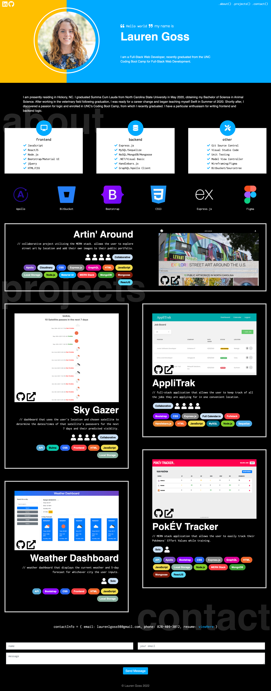

# lauren-goss-portfolio-react

Portfolio created with React to share some information about myself, showcase my deployed applications, and share my contact information.

## About Me

I am a Full-Stack Web Developer, currently enrolled in the UNC Coding Boot Camp for Full-Stack Web Development.

I am presently residing in Hickory, NC. I graduated Summa Cum Laude from North Carolina State University in May 2020, obtaining my Bachelor of Science in Animal Science. After working in the veterinary field following graduation, I was ready for a career change and began teaching myself Swift in Summer of 2020. Shortly after, I discovered a passion for logic and enrolled in UNC's Coding Boot Camp, from which I will graduate in November 2021. I have a particular enthusiasm for writing frontend and backend logic.

My portfolio can be visited [here](https://laurenlgoss.github.io/lauren-goss-portfolio/). 🙂

## Screenshot of Portfolio

